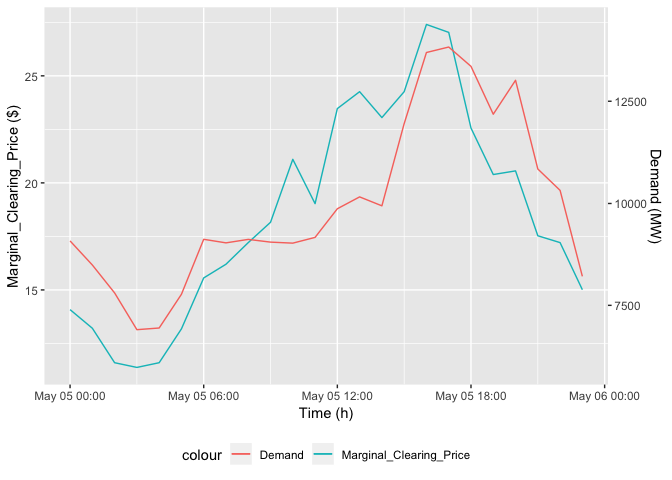
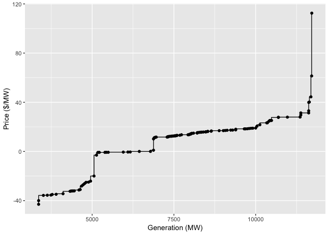

Code
----

The code below is the main code to estimate the marginal clearing
prices. All the important steps in the analysis are mentioned as
comments in the code.

    library(lubridate)
    library(dplyr)
    library(ggplot2)

    #Reading the data and converting the timestamp to a POSIX time

    sced_data<-read.csv('SCED_data.csv', header = T, check.names = F, stringsAsFactors = F)
    demand_data<-read.csv('DemandData.csv', header = T, check.names = F, stringsAsFactors = F)

    sced_data$Time<-as.POSIXct(strptime(sced_data$Time, format = "%Y-%m-%d %H:%M:%S", tz = "US/CENTRAL"))
    demand_data$Time<-as.POSIXct(strptime(demand_data$Time, format = "%Y-%m-%d %H:%M:%S", tz = "US/CENTRAL"))

    cp_data<-NULL
    for (hour in unique(hour(sced_data$Time)))
    {
      data<-matrix(ncol = 3)
      colnames(data)<-c("bid_price","bid_cap","bids")
      
      #Filtering the data by hour
      
      sced_hour<-filter(sced_data,hour(Time)==hour)
      
      for (gen in unique(sced_hour$Resource.Name))
      {
        #Filtering the hourly data by generator and segregating the price and generation in separate columns
        
        temp<-filter(sced_hour, Resource.Name==gen)
        
        
        bid_cap<-temp[,grep("MW",colnames(temp))]
        bid_price<-temp[,grep("Price", colnames(temp))]
        
        data_temp<-data.frame(bid_price=t(bid_price),bid_cap=t(bid_cap))
        
        data_temp<-data_temp[which(data_temp$bid_cap>0),]
        
        #Calculating the generation in particular hour for every bid by each generator
        
        data_temp$bids<-c(data_temp$bid_cap[1],diff(as.numeric(data_temp$bid_cap)))
        data<-rbind(data,data_temp)
      }
      
      data<-data[-1,]
      row.names(data)<-c(1:nrow(data))
      
      #Stacking the generation bids in increasing order of the bid price (marginal cost) to build a supply curve (generation stack) in that hour
      
      data_order<-data[order(data$bid_price),c(1,2,3)]
      data_order<-data_order[which(data_order$bids>0),]
      temp_bid_data=NULL
      temp_bid_data=t(c(-250,0))
      for(bp in unique(data_order$bid_price))
      {
        cap<-sum(data_order$bids[which(data_order$bid_price==bp)])
        temp_row<-cbind(bp,cap)
        temp_bid_data<-rbind(temp_bid_data,temp_row)
      }
      temp_bid_data<-as.data.frame(cbind(temp_bid_data,cumsum(temp_bid_data[,2])))
      colnames(temp_bid_data)<-c("bp","cap","cumcap")
      
      #Estimating the clearing price in a particular hour which is the bid price (marginal cost) of the generator on the margin of the bin where demand curve meets the supply curve
      
      demand<-demand_data$Demand[which(hour(demand_data$Time)==hour)]
      clearing_price<-temp_bid_data$bp[min(which(temp_bid_data$cumcap>demand))]
      cp_row<-c(as.character(demand_data$Time[which(hour(demand_data$Time)==hour)]),max(temp_bid_data$cumcap), clearing_price)
      cp_data<-rbind(cp_data,cp_row)
    }

    cp_data<-data.frame(Time=as.POSIXct(strptime(cp_data[,1], format = "%Y-%m-%d %H:%M:%S", tz = "US/CENTRAL")), Capacity=round(as.numeric(as.character(cp_data[,2]))/1000, digits=2), Marginal_Clearing_Price=as.numeric(as.character(cp_data[,3])))
    cp_data$Time[1]<-as.POSIXct(strptime("2016-05-05 00:00:00", format = "%Y-%m-%d %H:%M:%S", tz = "US/CENTRAL"))
    rownames(cp_data)<-c(1:nrow(cp_data))

    #cp_data is a data frame containing the output

    write.csv(cp_data, "Output_MCP_Timeserice.csv", row.names = F)

Output
------

### Clearing Price

The table below is the main output of the analysis. It shows the
timeseries of Marginal Clearing Price ($) in every hour and total
Generation Capacity (GW) for reference.

    ##                   Time Capacity Marginal_Clearing_Price
    ## 1  2016-05-05 00:00:00    12.44                   14.08
    ## 2  2016-05-05 01:00:00    12.16                   13.21
    ## 3  2016-05-05 02:00:00    12.44                   11.60
    ## 4  2016-05-05 03:00:00    11.55                   11.38
    ## 5  2016-05-05 04:00:00    11.58                   11.60
    ## 6  2016-05-05 05:00:00    12.14                   13.18
    ## 7  2016-05-05 06:00:00    12.34                   15.56
    ## 8  2016-05-05 07:00:00    12.19                   16.20
    ## 9  2016-05-05 08:00:00    11.69                   17.21
    ## 10 2016-05-05 09:00:00    11.74                   18.16
    ## 11 2016-05-05 10:00:00    10.82                   21.10
    ## 12 2016-05-05 11:00:00    11.43                   19.03
    ## 13 2016-05-05 12:00:00    11.93                   23.47
    ## 14 2016-05-05 13:00:00    12.19                   24.26
    ## 15 2016-05-05 14:00:00    12.45                   23.05
    ## 16 2016-05-05 15:00:00    14.38                   24.26
    ## 17 2016-05-05 16:00:00    14.96                   27.40
    ## 18 2016-05-05 17:00:00    15.10                   27.03
    ## 19 2016-05-05 18:00:00    15.60                   22.56
    ## 20 2016-05-05 19:00:00    14.84                   20.39
    ## 21 2016-05-05 20:00:00    15.14                   20.56
    ## 22 2016-05-05 21:00:00    13.75                   17.53
    ## 23 2016-05-05 22:00:00    13.41                   17.21
    ## 24 2016-05-05 23:00:00    11.82                   15.01

### Visualization

The above figure shows the marginal clearing price ($) and the hourly
demand (MW) for reference. The marginal clearing price follows the same
general trend as the demand which roughly validates the analysis.

### Example Supply Curve at 23:00:00 on May 06 2015 (excluding extreme prices)

The above figure shows the supply curve (generation stack) in the hour
23:00:00. To make the visualization better, it does not show the
generation for prices lower than -44.99 $/MW and greater than 112.50
$/MW but those data points are still considered in the analysis.

Methodology
-----------

The market clearing price of electricity in any given hour is the price
where demand is equal to the supply. Which means it is the price where
demand curve and supply curve intersect.

The electricity demand is assumed to be perfectly inelastic. Which means
that the demand does not change with price. Hence it is a vertical line
parallel to the Price axis passing through the generation axis at the
demand in any given hour.

The supply however, is elastic. The supply curve is modeled using the
generator bid data (Security Constrained Economic Dispatch Data) in any
given hour. The generation from each generator for every bid in each
hour are calculated using the SECD data. For example, if a generator is
bidding 250 MW at 25 $/MW, 275MW at 26 $/MW and 280 MW at 32 $/MW, it
means that it is willing to sell 250 MW at 25 $/MW, 25 MW at 26 $/MW and
5 MW at 32 $/MW. Stacking the generation bids from each generator in a
particular hour in an increasing order of the cost gives the supply
curve and total generation in that particular hour.

The market clearing price in any given hour is the cost of the generator
(unit of electricity) on the margin of the bin where the demand curve
meets the supply curve.
